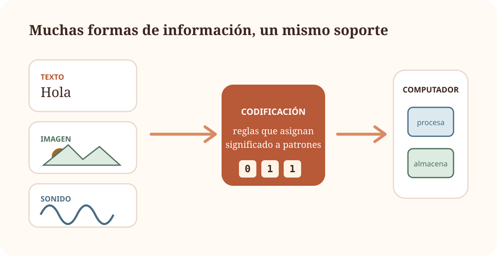
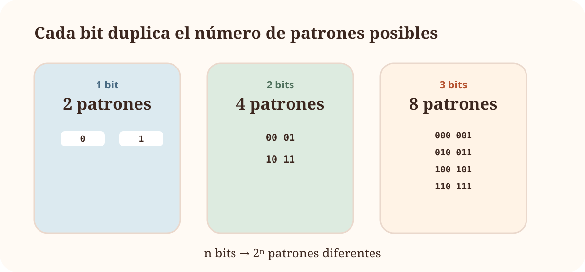
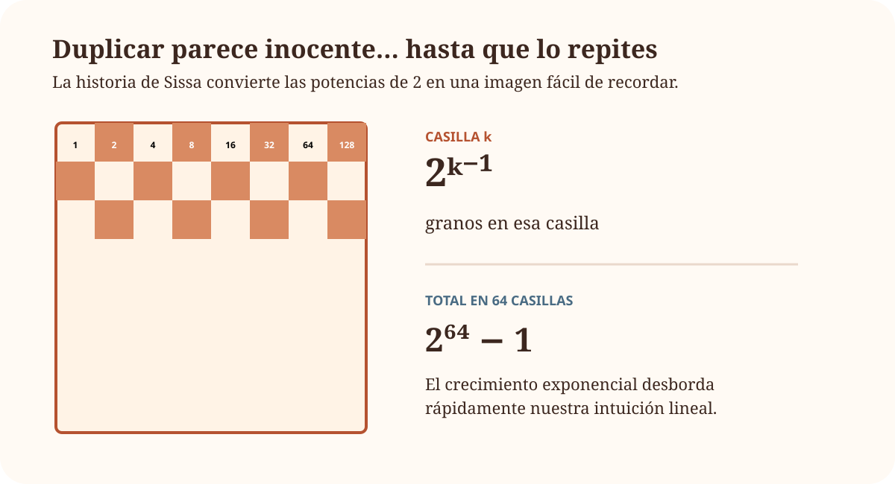
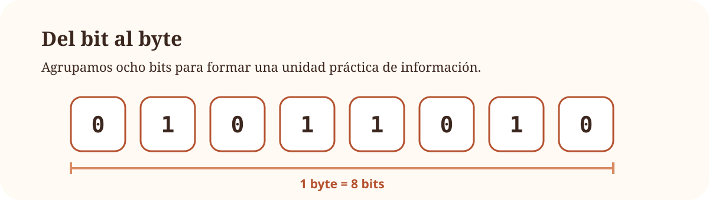

::: {.chapter-hero}
::: {.chapter-hero-copy}
TEMA 1 · PROTOTIPO VISUAL

# ¿Qué hace realmente un computador?

Escribimos, escuchamos música, enviamos fotografías o ejecutamos programas. Para nosotros son actividades muy distintas. Para el computador, todas terminan convirtiéndose en **información representada mediante patrones que puede almacenar y transformar**.

Este tema empieza construyendo esa idea desde cero.
:::

::: {.chapter-hero-art}
{fig-alt="Texto, imágenes y sonido se codifican como patrones de bits que puede procesar un computador."}
:::
:::

::: {.objetivos}
En este primer recorrido vamos a construir cuatro ideas que utilizaremos durante todo el curso:

- un computador **recibe, representa, almacena y procesa información**;
- un mismo patrón físico puede adquirir significados distintos según el código utilizado;
- con $n$ bits podemos construir $2^n$ patrones diferentes;
- bits y bytes son la base para expresar información y capacidad.
:::

::: {.visual-roadmap}

1.1<strong>¿Qué es un computador?</strong>

→

1.2<strong>¿Cómo representa información?</strong>

→

1.3<strong>¿Qué hay dentro?</strong>

→

1.4+<strong>¿Cómo funciona todo junto?</strong>

:::

## 1.1 ¿Qué es un computador? {#sec-que-es-computador}

::: {.lesson-opening}
::: {.lesson-opening-copy}
UNA PRIMERA IDEA

### Antes de abrir la caja

Un portátil, un teléfono, una consola y la centralita de un automóvil tienen aspectos y usos muy distintos. Sin embargo, podemos empezar a entenderlos con una idea común:

> **reciben información, realizan un procesamiento y producen algún resultado.**

Todavía no necesitamos saber qué procesador utilizan ni qué ocurre dentro de la memoria.
:::

::: {.lesson-opening-visual}

  
ENTRADA<strong>datos</strong><small>teclas, imagen, medida…</small>

  
→

  
PROCESAMIENTO<strong>computador</strong><small>aplica instrucciones</small>

  
→

  
SALIDA<strong>resultado</strong><small>pantalla, sonido, acción…</small>

:::
:::

### Información y datos

Imagina que recibes únicamente este valor:

23

¿Es una temperatura? ¿Una edad? ¿El número de estudiantes de un grupo? ¿Una dirección de memoria?

El símbolo por sí solo no nos lo dice. Necesitamos conocer **qué representa** y **cómo debe interpretarse**.

::: {.concepto-clave}
Un **dato** es una representación que puede ser almacenada, transmitida o procesada. Hablamos de **información** cuando esa representación se interpreta dentro de un contexto y adquiere significado.
:::

::: {.split-layout}
::: {.split-copy}
### Codificar es acordar una representación

No hace falta empezar con binario para entender qué significa *codificar*. Un semáforo ya utiliza un código:

- rojo → detenerse;
- verde → avanzar.

La señal física y su significado no son la misma cosa. Hay una **regla de interpretación** que los relaciona.
:::

::: {.split-visual}

  

→<strong>detenerse</strong>
  

→<strong>avanzar</strong>

:::
:::

Ahora podemos trasladar la misma idea a símbolos:

| Patrón | Significado acordado |
|:---:|:---|
| `00` | A |
| `01` | B |
| `10` | C |
| `11` | D |

Otro código podría utilizar una correspondencia distinta. Lo esencial es que quien produce y quien interpreta los datos compartan las mismas reglas.

::: {.importante}
El computador no «ve» una letra **A**, una fotografía o una canción como nosotros. Manipula representaciones físicas. El significado aparece al interpretar esas representaciones según un código.
:::

### Hardware y software: dos piezas de una misma historia

::: {.concept-duo}
::: {.concept-card}
◫

**Hardware**

Los componentes físicos capaces de almacenar, mover y transformar representaciones.
:::

::: {.concept-card}
⌘

**Software**

Las instrucciones y programas que indican qué transformaciones debe realizar el hardware.
:::
:::

No profundizaremos todavía en ninguno de los dos. De momento basta una idea: **el hardware hace posible el procesamiento; el software determina qué procesamiento queremos realizar**.

::: {.ejercicio titulo="Entrada, procesamiento y salida" numero="1.1" dificultad="1"}
Identifica una posible **entrada**, el **procesamiento** y la **salida** en cada caso:

1. una calculadora suma dos números;
2. una cámara de móvil toma una fotografía;
3. una aplicación de navegación calcula una ruta.

::: {.solucion}
En una calculadora, los números y la operación son la entrada; realizar la suma es el procesamiento; el valor mostrado es la salida.

En una cámara, la luz captada por el sensor es una entrada; el sistema procesa las medidas del sensor; la imagen almacenada o mostrada es una salida.

En una aplicación de navegación, origen, destino y datos cartográficos actúan como entradas; el cálculo de la ruta es el procesamiento; la ruta propuesta es la salida.
:::
:::

::: {.resumen}
**Qué deberías llevarte de 1.1**

- Un computador puede entenderse inicialmente como un sistema que transforma datos.
- Los datos necesitan reglas de interpretación para adquirir significado.
- Codificar consiste en establecer una correspondencia entre información y representaciones.
- Hardware y software cooperan para realizar el procesamiento.
:::

## 1.2 ¿Cómo representa la información? {#sec-representacion}

::: {.lesson-opening lesson-opening-rust}
::: {.lesson-opening-copy}
DE MUCHAS COSAS A DOS ESTADOS

### Letras, imágenes, sonido… ¿con solo 0 y 1?

Un computador debe manejar tipos de información muy diferentes. La estrategia fundamental consiste en representarlos mediante combinaciones de elementos que puedan distinguirse de forma fiable.

Dos estados son especialmente cómodos: encendido/apagado, tensión alta/baja, presencia/ausencia de carga…

Los símbolos `0` y `1` nos permiten **nombrar** esos dos estados.
:::

::: {.lesson-opening-visual}
{fig-alt="Diferentes formas de información se transforman mediante una codificación en patrones de bits."}
:::
:::

::: {.importante}
En este punto, `0` y `1` no deben entenderse únicamente como números. Son también **símbolos para representar dos estados distinguibles**.
:::

### El bit: la pieza mínima

Llamamos **bit** a una unidad que puede encontrarse en uno de dos estados posibles.

Antes de escribir ninguna fórmula, observemos qué ocurre cuando agrupamos bits.

{fig-alt="Con uno, dos y tres bits se obtienen respectivamente dos, cuatro y ocho patrones diferentes."}

Cada vez que añadimos un bit, cada patrón anterior puede terminar en `0` o en `1`. Por eso el número de combinaciones **se duplica**.

::: {.content-visible when-format="html"}

  

    

      PRUÉBALO
      <h4>Construye el espacio de combinaciones</h4>
    

    

      <label>Número de bits: <strong data-bit-value>3</strong></label>
      <input type="range" min="1" max="6" value="3" step="1" aria-label="Número de bits">
    

  

  
<strong data-combination-count>8</strong> patrones posibles

  

:::

Ahora sí tiene sentido formalizar el patrón observado:

$$
n\text{ bits}\quad\longrightarrow\quad 2^n\text{ patrones}
$$

::: {.concepto-clave}
Con $n$ bits pueden construirse **$2^n$ patrones distintos**. El número de bits determina cuántas posibilidades podemos distinguir; el código determina qué significa cada posibilidad.
:::

### Una historia para recordar las potencias de 2

La leyenda de **Sissa y el tablero de ajedrez** utiliza una regla muy sencilla: colocar un grano en la primera casilla y duplicar la cantidad en cada casilla siguiente.

{fig-alt="Un tablero de ajedrez ilustra el crecimiento exponencial al duplicar la cantidad en cada casilla."}

La historia no es importante por el ajedrez. Es útil porque muestra una idea que reaparecerá constantemente en informática: **duplicar muchas veces produce cantidades enormes mucho antes de lo que sugiere nuestra intuición**.

### ¿Cuántos bits necesito?

Hasta ahora hemos preguntado cuántos patrones obtenemos con un número conocido de bits. Ahora invertimos la pregunta.

::: {.ejercicio titulo="Codificar los diez dígitos" numero="1.2" dificultad="1"}
Queremos asignar un patrón binario diferente a cada dígito decimal (`0` a `9`). ¿Cuántos bits necesitamos como mínimo?

::: {.solucion}
Con 3 bits disponemos de:

$$
2^3=8
$$

patrones, que no son suficientes.

Con 4 bits disponemos de:

$$
2^4=16
$$

patrones. Por tanto, el mínimo es **4 bits**.
:::
:::

La pregunta general es:

> Si necesito distinguir $N$ posibilidades, ¿cuál es el menor número de bits que proporciona al menos $N$ patrones?

Buscamos el menor $n$ que cumpla:

$$
2^n\ge N
$$

y podemos expresarlo mediante:

$$
n=\lceil \log_2 N\rceil
$$

El logaritmo aparece así **después** de entender la pregunta que resuelve.

::: {.split-layout split-layout-highlight}
::: {.split-copy}
### La misma relación, en dos direcciones

Si conocemos los bits, usamos una potencia:

$$
n \longrightarrow 2^n
$$

Si conocemos cuántos símbolos queremos distinguir, necesitamos invertir la relación:

$$
N \longrightarrow \lceil\log_2N\rceil
$$
:::

::: {.split-visual formula-question}
¿cuántos patrones tengo?
<strong>$2^n$</strong>

¿cuántos bits necesito?
<strong>$\lceil\log_2N\rceil$</strong>
:::
:::

### Del bit al byte

Trabajar con bits individuales resulta poco práctico. Por convenio, una agrupación de **ocho bits** forma un **byte**.

{fig-alt="Ocho celdas binarias forman un byte."}

A partir del byte expresamos tamaños mayores.

::: {.unit-ladder}

1 kB<strong>10³ bytes</strong><small>decimal</small>

1 MB<strong>10⁶ bytes</strong><small>decimal</small>

1 GB<strong>10⁹ bytes</strong><small>decimal</small>

1 KiB<strong>2¹⁰ bytes</strong><small>binario</small>

1 MiB<strong>2²⁰ bytes</strong><small>binario</small>

1 GiB<strong>2³⁰ bytes</strong><small>binario</small>

:::

### Bit y byte: una diferencia pequeña en la letra, enorme en el cálculo

En comunicaciones es habitual expresar velocidades en **bits por segundo**. En almacenamiento es habitual expresar tamaños en **bytes**.

Por eso:

  
<strong>100 Mb/s</strong>100 megabits cada segundo

  
≠

  
<strong>100 MB/s</strong>100 megabytes cada segundo

Como $1\ \text{byte}=8\ \text{bits}$, la diferencia es un factor 8.

::: {.ejercicio titulo="Tiempo de descarga" numero="1.3" dificultad="2"}
Ignorando pérdidas y sobrecargas, ¿cuánto tardaría en descargarse un archivo de **1 GB** mediante una conexión de **100 Mb/s**? Utiliza unidades decimales.

::: {.solucion}
Primero expresamos el archivo en bits:

$$
1\ \text{GB}=8\ \text{Gb}=8000\ \text{Mb}
$$

Después usamos:

$$
t=\frac{\text{cantidad de información}}{\text{velocidad}}
$$

por lo que:

$$
t=\frac{8000\ \text{Mb}}{100\ \text{Mb/s}}=80\ \text{s}
$$

En condiciones ideales, la descarga tardaría aproximadamente **80 segundos**.
:::
:::

::: {.resumen}
**Qué deberías llevarte de 1.2**

- Un bit permite distinguir dos estados.
- Cada bit adicional duplica el número de patrones disponibles.
- $n$ bits producen $2^n$ patrones.
- $\lceil\log_2N\rceil$ responde a la pregunta «¿cuántos bits necesito para distinguir $N$ posibilidades?».
- Ocho bits forman un byte.
- `b` y `B` no son intercambiables: bit y byte representan cantidades distintas.
:::

## La historia continúa

Hasta aquí hemos respondido dos preguntas:

  
✓<strong>¿Qué es un computador?</strong><small>Un sistema capaz de representar y transformar datos siguiendo instrucciones.</small>

  
✓<strong>¿Cómo representa información?</strong><small>Mediante códigos construidos sobre patrones de bits.</small>

La siguiente pregunta surge de forma natural:

> **Si ya tenemos datos representados como bits, ¿dónde se guardan y quién los procesa?**

Ahí abriremos por primera vez la caja: **CPU, memoria y entrada/salida**.
