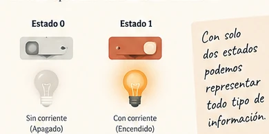

<a class="brand" href="../../index.html">Fundamentos de Informática</a>
<nav><a href="index.html">Tema 1</a>Lección 1.2</nav>

LECCIÓN 1.2

<h1>¿Cómo representa la información?</h1>

¿Cómo puede un computador representar una letra, una fotografía o una canción utilizando únicamente dos estados?

## 1. Dos estados, muchas posibilidades {.section-heading}

Un circuito digital puede distinguir de forma fiable dos estados. Dependiendo de la tecnología, pueden corresponder a tensión alta/baja, presencia/ausencia de carga o muchas otras realizaciones físicas.

<figure class="editorial-figure medium">

<figcaption>Los símbolos 0 y 1 nos permiten nombrar dos estados distinguibles.</figcaption>
</figure>

::: {.importante}
Aquí `0` y `1` no son únicamente números: son también **símbolos para representar dos estados**.
:::

## 2. El bit y las combinaciones {.section-heading}

Un **bit** (*binary digit*) puede tomar dos valores. Cuando agrupamos bits, el número de patrones posibles crece muy deprisa.

1 bit<strong>2</strong><small>0 · 1</small>

2 bits<strong>4</strong><small>00 · 01 · 10 · 11</small>

3 bits<strong>8</strong><small>000 … 111</small>

Cada bit añadido **duplica** las posibilidades. Solo después de observar ese patrón merece la pena escribir la regla general:

$$n\text{ bits}\quad\longrightarrow\quad 2^n\text{ patrones}$$

PRUÉBALO<label>Número de bits: <strong data-bit-value>3</strong><input type="range" min="1" max="6" value="3" step="1" aria-label="Número de bits"></label>

<strong data-combination-count>8</strong> combinaciones

## 3. ¿Cuántos bits necesito? {.section-heading}

Ahora invertimos la pregunta. Si queremos representar $N$ símbolos distintos, necesitamos el menor número de bits que cumpla:

$$2^n\ge N$$

Por tanto,

$$n=\lceil\log_2N\rceil$$

::: {.ejercicio titulo="Codificar los diez dígitos" numero="1.2" dificultad="1"}
¿Cuántos bits hacen falta como mínimo para disponer de un patrón diferente para cada uno de los diez dígitos decimales (`0` a `9`)?

::: {.solucion}
Con 3 bits solo disponemos de $2^3=8$ patrones. Con 4 bits tenemos $2^4=16$. El mínimo es **4 bits**.
:::
:::

## 4. Del bit al byte {.section-heading}

Ocho bits agrupados forman un **byte**. A partir de ahí aparecen las unidades habituales para expresar capacidad de memoria y almacenamiento.

10110010<strong>8 bits = 1 byte</strong>

DECIMAL
<h3>kB · MB · GB</h3>
Potencias de 10.

BINARIO
<h3>KiB · MiB · GiB</h3>
Potencias de 2.

## 5. bit y byte no son lo mismo {.section-heading}

Una conexión anunciada como **100 Mb/s** expresa una velocidad en megabits por segundo. Un archivo de **1 GB** expresa un tamaño en gigabytes. La diferencia entre `b` y `B` cambia el cálculo por un factor de ocho.

::: {.ejercicio titulo="Tiempo de descarga" numero="1.3" dificultad="2"}
Ignorando pérdidas y sobrecargas, ¿cuánto tardaría en descargarse un archivo de 1 GB a través de una conexión de 100 Mb/s? Utiliza unidades decimales.

::: {.solucion}
$1\,\text{GB}=8\,\text{Gb}=8000\,\text{Mb}$.

$$t=\frac{8000\,\text{Mb}}{100\,\text{Mb/s}}=80\,\text{s}$$

En condiciones ideales, aproximadamente **80 segundos**.
:::
:::

IDEA ESENCIAL
Los bits proporcionan patrones; los códigos determinan qué representa cada patrón.

