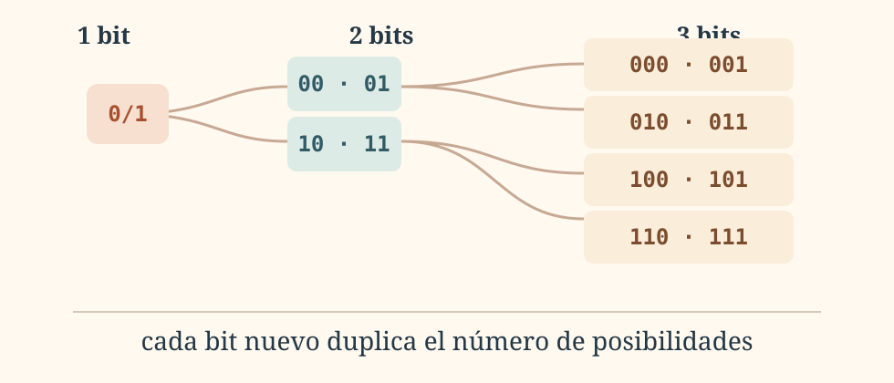
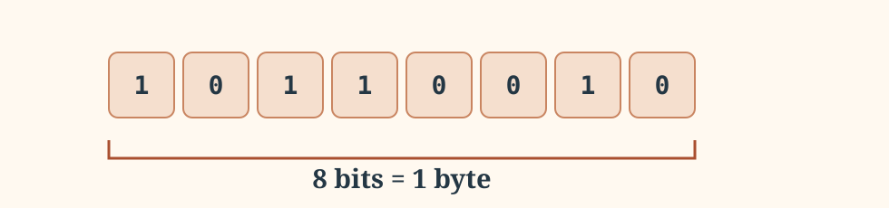

LECCIÓN 1.2
<h1>¿Cómo representa la información?</h1>

¿Cómo puede un computador representar una letra, una fotografía o una canción utilizando únicamente dos estados?

## 1. Dos estados, muchas posibilidades {.editorial-section}

Un circuito digital puede distinguir con gran fiabilidad dos estados. Dependiendo de la tecnología, pueden corresponder a tensión alta/baja, presencia/ausencia de carga o muchas otras realizaciones físicas.

○

<strong>Estado 0</strong>
<small>sin corriente · apagado</small>

●

<strong>Estado 1</strong>
<small>con corriente · encendido</small>

Con solo dos estados podemos construir representaciones mucho más ricas.

::: {.importante}
Aquí `0` y `1` no son únicamente números: son **símbolos que utilizamos para nombrar dos estados distinguibles**.
:::

## 2. El bit y las combinaciones {.editorial-section}

Un **bit** (*binary digit*) es una unidad que puede tomar dos valores. Al combinar varios bits aparecen más posibilidades.

Cada nuevo bit duplica el número de patrones que podemos construir. Tras observar el patrón, ya tiene sentido escribirlo de forma general:

Con <strong>n</strong> bits podemos representar <strong>2n</strong> patrones diferentes.

PRUÉBALO
<h3>Explora las combinaciones</h3>

<label>Número de bits: <strong data-bit-value>3</strong><input type="range" min="1" max="6" value="3" step="1" aria-label="Número de bits"></label>

<strong data-combination-count>8</strong>combinaciones

## 3. ¿Cuántos bits necesito? {.editorial-section}

Ahora invertimos la pregunta. Si queremos representar **N** símbolos diferentes, buscamos el menor número de bits capaz de producir al menos **N** patrones:

Bits conocidos<strong>n</strong><small>¿cuántos patrones?</small><b>2n</b>

↔

Símbolos conocidos<strong>N</strong><small>¿cuántos bits?</small><b>⌈log2N⌉</b>

::: {.ejercicio titulo="Codificar los diez dígitos" numero="1.2" dificultad="1"}
¿Cuántos bits hacen falta como mínimo para disponer de un patrón diferente para cada uno de los diez dígitos decimales (`0` a `9`)?

::: {.solucion}
Con 3 bits solo disponemos de $2^3=8$ patrones, así que no basta. Con 4 bits tenemos $2^4=16$ patrones. El mínimo es **4 bits**.
:::
:::

## 4. Del bit al byte {.editorial-section}

Ocho bits agrupados forman un **byte**.

Decimal<strong>kB · MB · GB</strong><small>potencias de 10</small>

Binario<strong>KiB · MiB · GiB</strong><small>potencias de 2</small>

## 5. bit y byte no son lo mismo {.editorial-section}

<strong>100 Mb/s</strong>megabits por segundo<small>velocidad de transmisión</small>

<b>≠</b>

<strong>1 GB</strong>gigabyte<small>tamaño de un archivo</small>

::: {.ejercicio titulo="Tiempo de descarga" numero="1.3" dificultad="2"}
Ignorando pérdidas y sobrecargas, ¿cuánto tardaría en descargarse un archivo de 1 GB a través de una conexión de 100 Mb/s? Utiliza unidades decimales.

::: {.solucion}
$1\,\text{GB}=8\,\text{Gb}=8000\,\text{Mb}$.

$$t=\frac{8000\,\text{Mb}}{100\,\text{Mb/s}}=80\,\text{s}$$

En condiciones ideales, aproximadamente **80 segundos**.
:::
:::

IDEA ESENCIAL

Los bits no tienen significado por sí solos. Nos proporcionan patrones; los códigos determinan qué representa cada patrón.

