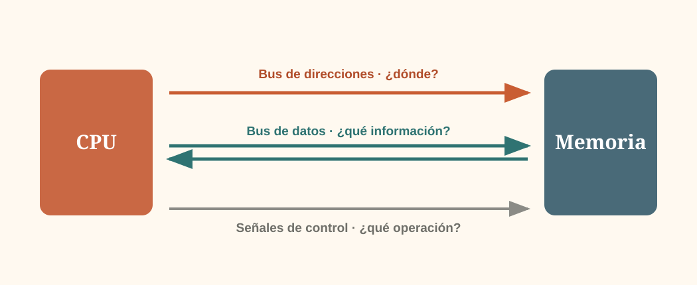

  LECCIÓN 1.4
  <h1>¿Cómo se comunican sus componentes?</h1>
  
Un computador está formado por elementos que necesitan intercambiar información. ¿Cómo sabe la CPU dónde leer, qué dato mover y qué operación realizar?

## 1. Una primera idea {.editorial-section}

Imaginemos un computador muy simple con una CPU y una memoria. La CPU necesita leer y escribir información almacenada en la memoria.

  
CPU

  
?<small>necesitamos un sistema de comunicación</small>

  
Memoria

## 2. Tres preguntas diferentes {.editorial-section}

La comunicación no resuelve una sola pregunta, sino tres:

  
1<strong>¿Dónde?</strong><small>qué posición o dispositivo</small>

  
2<strong>¿Qué datos?</strong><small>qué información se transfiere</small>

  
3<strong>¿Qué operación?</strong><small>leer, escribir, sincronizar…</small>

::: {.concepto-clave}
El **bus de direcciones** identifica el destino; el **bus de datos** transporta la información; las **señales de control** indican qué operación debe realizarse.
:::

## 3. Un ejemplo paso a paso {.editorial-section}

La CPU quiere leer el contenido de la posición 5 de memoria:

<ol class="step-list">
  <li>1
Coloca la dirección <strong>5</strong> en el bus de direcciones.
</li>
  <li>2
Activa una señal de <strong>lectura</strong>.
</li>
  <li>3
La memoria coloca el contenido de la posición 5 en el <strong>bus de datos</strong>.
</li>
  <li>4
La CPU recibe ese dato.
</li>
</ol>

## 4. Direcciones y capacidad de memoria {.editorial-section}

Aquí reaparece una idea que ya conocemos. Si una dirección se expresa con **n bits**, podemos formar $2^n$ patrones distintos y, por tanto, distinguir $2^n$ posiciones.

<table class="editorial-table">
<thead><tr><th>Bits de dirección</th><th>Posiciones distinguibles</th></tr></thead>
<tbody>
<tr><td>8</td><td>256</td></tr>
<tr><td>16</td><td>65 536</td></tr>
<tr><td>32</td><td>4 294 967 296</td></tr>
</tbody>
</table>

Más bits de dirección → más posiciones identificables.

::: {.ejercicio titulo="Dimensionar una memoria" numero="1.6" dificultad="2"}
Un computador tiene un bus de direcciones de 20 bits. Si cada dirección identifica un byte, ¿cuántos bytes puede direccionar directamente?

::: {.solucion}
Con 20 bits podemos formar $2^{20}$ direcciones. Si cada dirección identifica un byte:

$$2^{20}\ \text{bytes}=1\ \text{MiB}$$
:::
:::

  IDEA ESENCIAL
  
Dirección, dato y control responden a preguntas diferentes. Distinguirlas evita la mayoría de confusiones iniciales sobre los buses.

