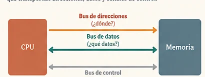

<a class="brand" href="../../index.html">Fundamentos de Informática</a>
<nav><a href="index.html">Tema 1</a>Lección 1.4</nav>

LECCIÓN 1.4

<h1>¿Cómo se comunican sus componentes?</h1>

Un computador está formado por elementos que necesitan intercambiar información. ¿Cómo sabe la CPU dónde leer, qué dato mover y qué operación realizar?

## 1. Una primera necesidad {.section-heading}

Imaginemos un computador muy simple con una CPU y una memoria. La CPU necesita leer y escribir información almacenada en la memoria. Antes de nombrar ningún bus, aparecen tres preguntas:

¿dónde?<small>qué posición</small>

¿qué?<small>qué información</small>

¿qué operación?<small>leer o escribir</small>

## 2. Tres funciones, tres tipos de señales {.section-heading}

<figure class="editorial-figure wide">

<figcaption>El bus de direcciones responde a «¿dónde?», el de datos a «¿qué información?» y las señales de control a «¿qué operación?».</figcaption>
</figure>

::: {.concepto-clave}
El **bus de direcciones** identifica el destino; el **bus de datos** transporta la información; las **señales de control** indican la operación que debe realizarse.
:::

## 3. Una lectura de memoria, paso a paso {.section-heading}

La CPU quiere leer el contenido de la posición 5:

1. coloca la dirección **5** en el bus de direcciones;
2. activa una señal de **lectura**;
3. la memoria coloca el contenido de esa posición en el **bus de datos**;
4. la CPU recibe el dato.

La secuencia importa: dirección, operación y transferencia son funciones distintas aunque ocurran coordinadamente.

## 4. Direcciones y capacidad {.section-heading}

Aquí reaparece una idea de la lección anterior. Si una dirección utiliza **n bits**, podemos formar $2^n$ patrones y distinguir $2^n$ posiciones.

| Bits de dirección | Posiciones distinguibles |
|---:|---:|
| 8 | 256 |
| 16 | 65 536 |
| 32 | 4 294 967 296 |

::: {.ejercicio titulo="Capacidad direccionable" numero="1.4" dificultad="2"}
Un computador utiliza direcciones de 32 bits y cada dirección identifica una palabra de 32 bits. ¿Cuál es la capacidad máxima de memoria direccionable?

::: {.solucion}
Hay $2^{32}$ direcciones y cada palabra ocupa 4 bytes. Por tanto:

$$2^{32}\times4\;\text{bytes}=2^{34}\;\text{bytes}=16\;\text{GiB}$$
:::
:::

CONEXIÓN
La misma idea matemática que contaba patrones binarios ahora cuenta posiciones de memoria.

