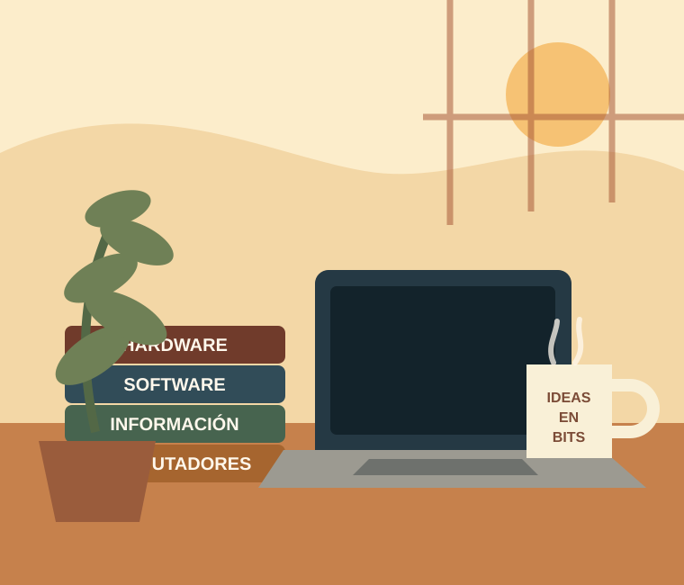

TEMA 1
<h1>Introducción a los computadores</h1>

Del mundo físico a la información digital

¿Qué ocurre realmente cuando pulsamos una tecla, ejecutamos un programa o reproducimos una canción?

Detrás de acciones cotidianas hay unas pocas ideas sorprendentemente sencillas: representar información, almacenarla, transformarla y comunicarla. En este tema construiremos ese modelo poco a poco.

<h2>En este tema aprenderás…</h2>
<ol class="learning-list">
<li><a href="01-que-es-computador.html">Qué es un computador y qué puede hacer</a></li>
<li><a href="02-representacion.html">Cómo representa la información</a></li>
<li>Qué hay dentro de un computador</li>
<li><a href="04-comunicacion.html">Cómo se comunican sus componentes</a></li>
<li>Cómo ejecuta un programa</li>
<li>Qué tipos de computadores existen</li>
<li>Qué papel juega el software</li>
</ol>

Una misma idea irá reapareciendo en contextos nuevos.

<strong>Pregunta guía del tema</strong>

¿Qué es realmente un computador y cómo consigue ejecutar un programa?

