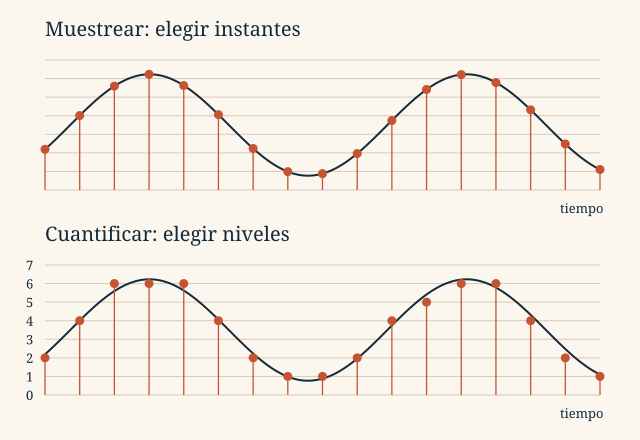

::::::: {.sheet .tema2-sheet}

:::::: {.running-head}
Tema 2 · Representación de la información

2.3
::::::

:::::: {.opening}
::::: {.kicker}
LECCIÓN 2.3
:::::

# ¿Cómo se digitaliza un sonido?

::::: {.deck}
La onda es continua. Para guardarla elegimos cuándo medirla, con qué precisión representar cada medida y cómo codificarla.
:::::

::::: {.short-rule}
:::::
::::::

:::::: {.lesson-section}
## 1. De la presión del aire a los bits

Un micrófono es un **transductor**: convierte variaciones de presión sonora en una señal eléctrica analógica. Todavía no hay bytes. La conversión analógica/digital obtiene muestras, aproxima sus amplitudes y las codifica.

| Etapa | Pregunta que resuelve |
|:--|:--|
| Muestreo | ¿En qué instantes medimos? |
| Cuantificación | ¿Qué nivel representa cada amplitud? |
| Codificación | ¿Qué bits escribimos para ese nivel? |

Después puede aplicarse compresión. Al reproducir recorremos el camino inverso: decodificación, muestras PCM, conversor digital/analógico y filtro de reconstrucción. El altavoz transforma la señal eléctrica en variaciones de presión.
::::::

:::::: {.lesson-section}
## 2. Muestreo: discretizar el tiempo

Tomamos una muestra cada período $T_s$. La frecuencia $f_s$ indica cuántas muestras obtenemos por segundo **en cada canal**:

$$f_s=\frac1{T_s},\qquad s[k]=s(kT_s)$$

Con 44.100 muestras/s, el intervalo es aproximadamente **22,7 μs**. Aumentar $f_s$ permite seguir variaciones más rápidas, pero produce más muestras.

{fig-alt="Dos gráficas: señal continua con muestras y las mismas muestras aproximadas a ocho niveles de amplitud."}

Para una señal de banda base limitada a una frecuencia máxima $B$, el límite de Nyquist–Shannon es $2B$. Usamos **$f_s>2B$** para evitar casos límite y disponer de margen de filtrado. El filtro antialiasing elimina componentes demasiado rápidas **antes** de muestrear.

Si no se respeta esa condición, diferentes señales pueden producir las mismas muestras: es el **aliasing**. Por ejemplo, senoidales de 9 Hz y 1 Hz coinciden en los instantes de un muestreo a 8 muestras/s. Aumentar los bits por muestra no resuelve ese problema temporal.

::: {.resource-note}
**Explora.** En el [interactivo de Nyquist–Shannon](../../assets/interactivos/nyquist-shannon.html), la onda está fijada en 1 Hz. Compara los muestreos a 8, 3, 2 y 1,5 Hz. En el caso de 2 Hz, observa que todas las muestras son cero para la fase mostrada; con 1,5 Hz, una onda de 0,5 Hz también pasa por las mismas muestras.
:::
::::::

:::::: {.lesson-section}
## 3. Cuantificación: discretizar la amplitud

Cada muestra se aproxima a un nivel entre un conjunto finito. Con $n_s$ bits disponemos de $2^{n_s}$ niveles: 3 bits proporcionan 8; 8 bits, 256; 16 bits, 65.536.

Para el mismo intervalo de amplitudes, más bits permiten pasos más finos y menor error de cuantificación. No garantizan por sí solos una grabación perfecta: también influyen el ruido, el micrófono y el muestreo.

En **PCM** (*Pulse Code Modulation*), cada muestra se expresa mediante una palabra binaria. Si cuatro muestras cuantificadas son 3, 5, 3 y 1, con tres bits sus palabras son `011`, `101`, `011` y `001`.
::::::

:::::: {.lesson-section}
## 4. De las muestras al tamaño

Cada segundo hay $f_s$ muestras por canal, $n_s$ bits por muestra y $c$ canales. Por tanto:

::: {.rule-band}
$$R=f_s n_s c\quad\text{bit/s},\qquad C=\frac{f_s n_s c\,t}{8}\quad\text{bytes}$$
Datos PCM sin comprimir, sin cabecera. La duración $t$ se expresa en segundos.
:::

Para audio CD estéreo: $44\,100\times16\times2=1\,411\,200$ bit/s. Un minuto requiere **10.584.000 B = 10,584 MB ≈ 10,094 MiB**.

| Configuración ilustrativa | $f_s$ | Bits | Canales | Tasa | 1 minuto |
|:--|--:|--:|--:|--:|--:|
| Telefonía G.711 | 8 kHz | 8 | 1 | 64 kbit/s | 0,480 MB |
| Ejemplo estéreo | 22,05 kHz | 8 | 2 | 352,8 kbit/s | 2,646 MB |
| CD | 44,1 kHz | 16 | 2 | 1411,2 kbit/s | 10,584 MB |
| Ejemplo a 48 kHz | 48 kHz | 16 | 2 | 1536 kbit/s | 11,520 MB |

Aquí kbit/s y MB son decimales. La fórmula PCM no calcula directamente el tamaño de un MP3. Para audio comprimido de tasa media $R$, usamos $C\approx Rt/8$: a 128 kbit/s, un minuto ocupa aproximadamente **0,960 MB**, más la sobrecarga del archivo.
::::::

:::::: {.lesson-section}
## 5. Qué hace un códec

Un **códec** codifica y decodifica la información. Las familias del material representan distintas cosas:

| Método | Idea |
|:--|:--|
| PCM | Codificar la amplitud de cada muestra. |
| DPCM | Codificar diferencias respecto de una predicción; en el caso simple, la muestra anterior. |
| ADPCM | Codificar el error de predicción adaptando parámetros, como el paso de cuantificación. |
| A-law y μ-law | Compansión: más resolución relativa para amplitudes pequeñas. |
| FLAC | Compresión sin pérdidas de las muestras de entrada. |
| MP3, AAC, Vorbis | Compresión perceptual, habitualmente con pérdidas. |

WAV y AIFF suelen contener PCM. AU admite distintas codificaciones; AIFF-C también admite compresión. Ogg puede contener Vorbis y M4A suele contener AAC. La **organización del archivo** y la **codificación del sonido** son decisiones diferentes. Tampoco existe un porcentaje universal de compresión.
::::::

:::::: {.lesson-section}
## 6. Streaming: recibir y reproducir a la vez

En una descarga obtenemos el archivo; en *streaming* comenzamos a reproducir mientras llegan más datos. El **búfer** acumula audio pendiente para absorber las variaciones de la red.

Si el búfer se vacía, la reproducción se interrumpe. Una reserva mayor tolera pausas más largas, a cambio de más espera inicial o retraso. La tasa útil media debe sostener el consumo y conviene disponer de margen; «necesitar el doble» no es una condición universal.

Las muestras también deben reproducirse con la frecuencia indicada: cambiar el ritmo modifica la duración y, en una reproducción directa, el tono. Practica estas relaciones en [los ejercicios de sonido](ejercicios.qmd#sonido).
::::::

:::::: {.running-foot}
Fundamentos de Informática

Tema 2 · 2.3
::::::

:::::::

::: {.lesson-nav}
[← Anterior](02-textos.qmd)

[Siguiente →](04-imagenes.qmd)
:::
