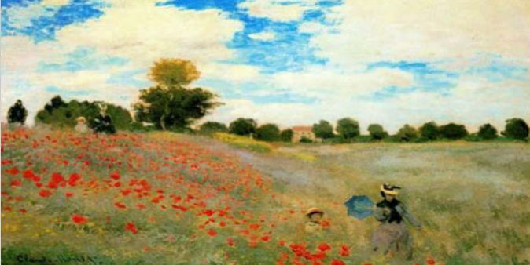
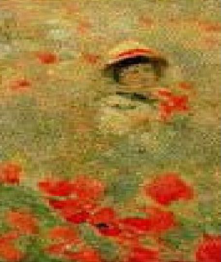
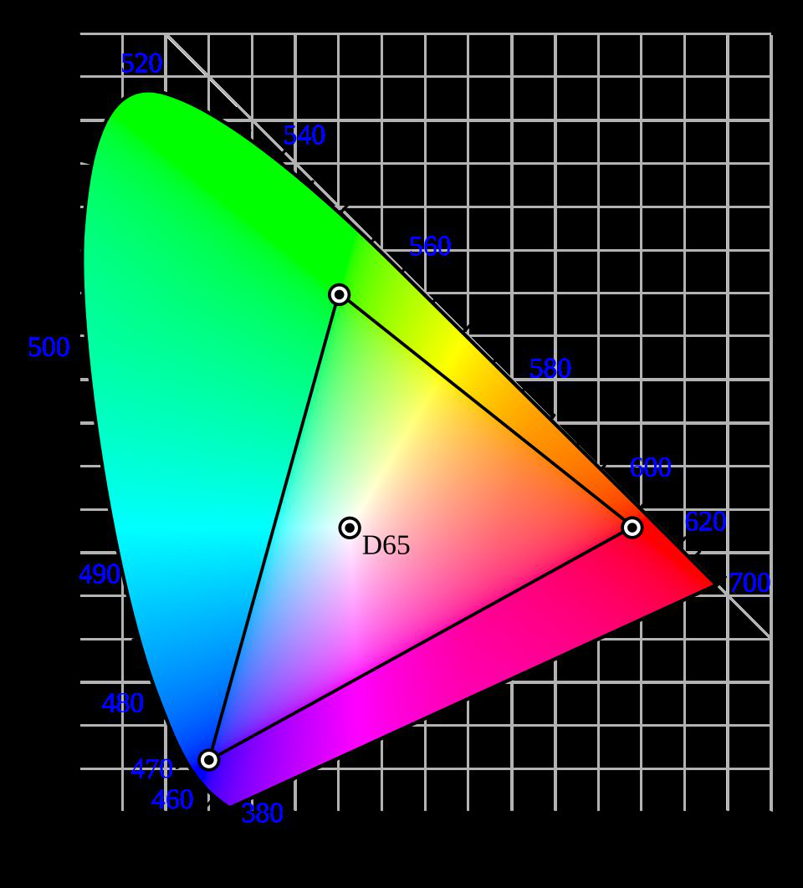
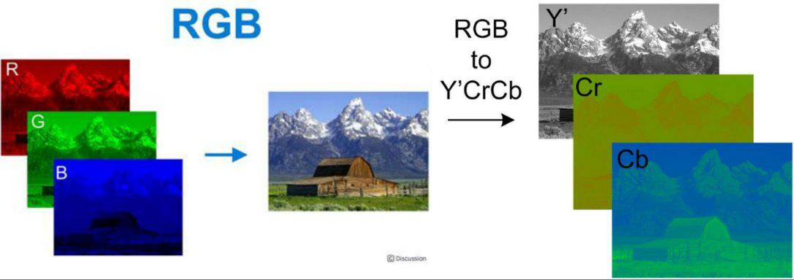
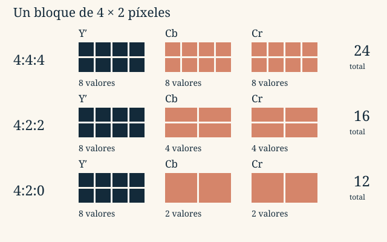

::::::: {.sheet .tema2-sheet}

:::::: {.running-head}
Tema 2 · Representación de la información

2.4
::::::

:::::: {.opening}
::::: {.kicker}
LECCIÓN 2.4
:::::

# ¿Cómo se representa una imagen?

::::: {.deck}
Una fotografía, un plano y un icono no necesitan la misma representación. La percepción visual ayuda a decidir qué guardar y qué podemos simplificar.
:::::

::::: {.short-rule}
:::::
::::::

:::::: {.lesson-section}
## 1. Percibir el conjunto y distinguir el detalle

La visión tiene una **resolución espacial limitada**. Al acercarnos a un cuadro distinguimos pinceladas; desde lejos las integramos en una escena. Los detalles siguen ahí, pero no siempre los resolvemos por separado.

::::: {.figure-pair}
{fig-alt="El cuadro Las amapolas de Monet, con figuras en un campo de flores."}

{fig-alt="Detalle ampliado de una figura del cuadro, donde se aprecian las pinceladas."}
:::::

También integramos información **en el tiempo**: una sucesión de imágenes fijas puede producir movimiento aparente. Intervienen la respuesta visual y el procesamiento cerebral; no se explica todo por la persistencia retiniana. Esta idea conectará con el vídeo.
::::::

:::::: {.lesson-section}
## 2. El color: luz, percepción y modelos

La luz visible abarca aproximadamente 380–780 nm. Tres tipos de conos responden a bandas **solapadas** de longitudes de onda. La percepción depende de la luz, los objetos, el observador y las condiciones; los conos no son tres detectores exclusivos de rojo, verde y azul.

La colorimetría describe los colores mediante valores triestímulo. **CIE XYZ** sirve como referencia independiente del dispositivo. El diagrama de cromaticidad CIE $x,y$ separa la información cromática de la luminancia. Los primarios de un dispositivo delimitan una **gama**: no cualquier combinación de sus tres luces reproduce todos los colores visibles.

{width=330 fig-alt="Diagrama CIE de cromaticidad con un triángulo RGB que ocupa solo una parte de los colores representados."}

| Modelo | Qué describe | Uso |
|:--|:--|:--|
| RGB | Intensidades de luz roja, verde y azul; mezcla aditiva. | Pantallas y proyectores. |
| CMYK | Tintas cian, magenta, amarilla y negra; mezcla sustractiva. | Impresión. |
| Y′CbCr | Luma y dos componentes de diferencia de color. | JPEG y vídeo. |
| HSL | Matiz, saturación y claridad. | Selección y edición de colores. |

En RGB, las tres luces a intensidad máxima producen blanco; en impresión, las tintas absorben parte de la luz. La conversión entre modelos depende de los espacios de color y de los dispositivos. La claridad L de HSL no es luminancia física.
::::::

:::::: {.lesson-section}
## 3. Píxeles o descripciones geométricas

Un **mapa de bits** es una retícula. Cada píxel contiene un gris, un color o un índice de paleta. Una representación **vectorial** guarda objetos: líneas, curvas, polígonos y texto, con sus posiciones y atributos.

::::: {.figure-pair}
{fig-alt="Cisne blanco sobre el agua."}

{fig-alt="Ampliación de la cabeza del cisne con la retícula de píxeles visible."}
:::::

Al ampliar un mapa de bits no recuperamos detalles que no fueron capturados. Interpolar suaviza o estima valores intermedios. Un dibujo vectorial puede recalcular sus curvas a otra escala y conservar bordes nítidos.

Los mapas de bits son adecuados para fotografías y texturas; los vectores, para esquemas, logotipos y planos. **SVG** describe geometría; **PDF** puede mezclar vectores, texto e imágenes. Vectorial no significa siempre menor tamaño: depende de la complejidad.
::::::

:::::: {.lesson-section}
## 4. Resolución y profundidad de color

La resolución espacial de una imagen se expresa aquí como **anchura × altura en píxeles**. La profundidad indica cuántos bits se dedican a cada píxel. Son parámetros distintos.

::: {.rule-band}
$$C=\frac{W H p}{8}\quad\text{bytes de datos sin comprimir}$$
$W$: anchura; $H$: altura; $p$: bits por píxel. Se excluyen cabeceras, paletas y relleno.
:::

Con RGB de ocho bits por componente, cada píxel usa **24 bits = 3 bytes** y admite $2^{24}$ combinaciones. El naranja del material es $(255,128,48)$, escrito como `FF 80 30` en orden R, G, B. El orden físico de canales de un archivo concreto puede ser distinto.

Una imagen de 10 × 15 píxeles ocupa $10\times15\times3=450$ B de datos RGB. Una imagen de 256 × 256 en grises de ocho bits ocupa **65.536 B = 64 KiB**. El tamaño real del archivo depende también de su formato.
::::::

:::::: {.lesson-section}
## 5. Elegir un formato

| Formato | Características del material |
|:--|:--|
| BMP | Representación matricial sencilla; el ejemplo es RGB sin comprimir. Existen variantes y puede haber relleno por filas. |
| TIFF | Flexible: distintas profundidades, RGB, CMYK o grises; puede usar compresión sin pérdidas o incorporar JPEG. |
| PNG | Compresión sin pérdidas; admite grises, RGB, paleta y transparencia. Útil para texto, capturas y bordes nítidos. |
| JPEG habitual | Compresión con pérdidas orientada a fotografías; calidad y tamaño dependen de los ajustes. |
| GIF | Colores indexados en paletas de hasta 256 entradas; compresión LZW, transparencia de índice y animación. |

La extensión no basta para determinar todas las propiedades. Un TIFF no garantiza ausencia de pérdidas; un PNG no restaura colores que se eliminaron antes de guardarlo.
::::::

:::::: {.lesson-section}
## 6. JPEG: separar detalle de brillo y de color

En muchas imágenes distinguimos mejor los detalles finos de brillo que los de color. **Y′CbCr** separa luma Y′ —relacionada con el brillo— y diferencias cromáticas Cb y Cr. Y′ no es exactamente luminancia física.

{fig-alt="Una fotografía descompuesta en rojo, verde y azul y, alternativamente, en luma Y prima, Cb y Cr."}

Podemos reducir la resolución de Cb y Cr manteniendo la de Y′. Es **submuestreo de crominancia** y sí elimina información: en bordes coloreados finos la pérdida puede verse.

{fig-alt="En 4:4:4 hay ocho muestras por componente; en 4:2:2 hay ocho de luma y cuatro de cada crominancia; en 4:2:0 hay ocho de luma y dos de cada crominancia."}

| Esquema | Y′ | Cb | Cr | Total de valores |
|:--|--:|--:|--:|--:|
| 4:4:4 | 8 | 8 | 8 | 24 |
| 4:2:2 | 8 | 4 | 4 | 16 |
| 4:2:0 | 8 | 2 | 2 | 12 |

Son **valores de componentes**, no bytes automáticamente: para obtener bits hay que multiplicar por su profundidad. La denominación 4:2:0 no significa que una componente cromática desaparezca.

En el JPEG habitual, el recorrido continúa:

1. **Separar componentes**, con submuestreo cromático opcional.
2. **Transformar bloques de 8 × 8** mediante DCT: describir sus variaciones espaciales mediante coeficientes.
3. **Cuantificar** esos coeficientes: aproximarlos, introduciendo pérdidas.
4. **Codificar** los resultados aprovechando su estructura y redundancia.

No hay que atribuir todas las pérdidas a la última etapa: el submuestreo y la cuantificación ya han descartado información. La DCT, por sí sola, cambia la representación; no es el paso que decide qué detalle eliminar.

::: {.resource-note}
**Explora.** Abre [JPEG paso a paso](../../assets/interactivos/jpeg-paso-a-paso.html). Compara la separación de componentes, el submuestreo y la cuantificación. Busca qué cambios afectan al color y cuáles introducen bloques o pérdida de detalle.
:::
::::::

:::::: {.lesson-section}
## 7. Paletas: guardar un índice por píxel

En una imagen indexada, cada píxel apunta a una entrada de una **paleta RGB**. Para 256 colores basta un índice de ocho bits. La paleta ocupa $256\times3=768$ B y se guarda una vez, no por cada píxel.

::: {.rule-band}
**Color directo:** R, G, B por píxel.\
**Color indexado:** un índice por píxel + una tabla compartida.
:::

La compresión LZW de GIF conserva los índices, pero reducir previamente una fotografía a 256 colores puede perder fidelidad. El **tramado** (*dithering*) combina píxeles de colores disponibles para simular visualmente tonos que faltan. GIF también puede guardar imágenes sucesivas con tiempos de presentación y un índice transparente.
::::::

:::::: {.lesson-section}
## 8. Datos teóricos y archivos reales

El cisne de 1024 × 768 píxeles necesita **2.359.296 B = 2,25 MiB** de datos RGB de 24 bits. En el ejemplo histórico de las diapositivas, distintas opciones de JPEG producen archivos de aproximadamente 523, 81,33 y 43,16 KB; PNG RGB ronda 1,15 MB. Son mediciones con Photoshop 7 y sus ajustes, no proporciones universales ni tamaños deducibles solo de la extensión.

Para comparar, fija primero la resolución y el modelo de color; después distingue **datos sin comprimir**, **paleta y cabeceras** y **compresión aplicada**. Los [ejercicios de imagen](ejercicios.qmd#imagen) trabajan cada cantidad por separado.
::::::

:::::: {.running-foot}
Fundamentos de Informática

Tema 2 · 2.4
::::::

:::::::

::: {.lesson-nav}
[← Anterior](03-sonidos.qmd)

[Siguiente →](05-video.qmd)
:::
