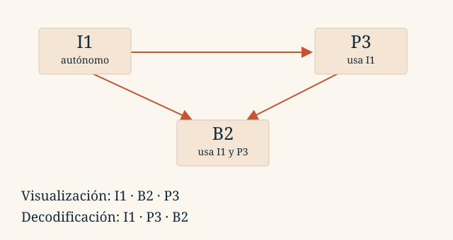

::::::: {.sheet .tema2-sheet}

:::::: {.running-head}
Tema 2 · Representación de la información

2.5
::::::

:::::: {.opening}
::::: {.kicker}
LECCIÓN 2.5
:::::

# ¿Cómo se guarda el movimiento?

::::: {.deck}
Un vídeo añade tiempo a las imágenes. Su tamaño depende de cuántos fotogramas guardamos y de cuánto aprovechamos lo que tienen en común.
:::::

::::: {.short-rule}
:::::
::::::

:::::: {.lesson-section}
## 1. Una secuencia de imágenes

El movimiento continuo se registra en instantes discretos. Los **fotogramas por segundo** (*fps*) indican cuántas imágenes se presentan cada segundo. No son los píxeles de cada imagen ni los bits de color de cada píxel.

{fig-alt="Cuatro fotografías sucesivas de un caballo al galope con distintas posiciones de las patas."}

La sucesión permite percibir movimiento. La fluidez y el parpadeo dependen también de la escena y de las condiciones de presentación; no existe un único número de fps que describa todas las situaciones.
::::::

:::::: {.lesson-section}
## 2. Cuánto ocuparía sin comprimir

Cada segundo contiene $f$ fotogramas. Cada uno tiene $W\times H$ píxeles y cada píxel necesita $p$ bits:

::: {.rule-band}
$$R=fWHp\quad\text{bit/s},\qquad C=\frac{fWHp\,t}{8}\quad\text{bytes}$$
Vídeo sin comprimir; sin audio, cabeceras ni metadatos.
:::

Un vídeo de 640 × 480 píxeles, 24 bits/píxel y 25 fps requiere **184.320.000 bit/s**. En un minuto son **1.382.400.000 B ≈ 1,38 GB**. El volumen explica por qué la compresión es fundamental.

Si el archivo contiene audio, se añade su tamaño. Para un flujo comprimido de tasa media conocida puede estimarse $C\approx Rt/8$, sin sustituir $R$ por la tasa del vídeo sin comprimir.
::::::

:::::: {.lesson-section}
## 3. Reutilizar lo que comparten los fotogramas

Entre dos imágenes cercanas puede cambiar poco: en el ejemplo de las diapositivas, se mueve un brazo mientras el cuerpo permanece parecido. Un códec puede predecir una imagen a partir de referencias y codificar la información necesaria para reconstruirla.

Un **GOP** (*Group of Pictures*, grupo de imágenes) organiza fotogramas y dependencias. En el modelo didáctico:

| Tipo | Referencias para reconstruirlo |
|:--|:--|
| I, intra | Se codifica sin depender de otras imágenes. |
| P, predictivo | Utiliza una referencia anterior en el ejemplo. |
| B, bidireccional | Utiliza referencias anterior y posterior en el ejemplo. |

«Guardar solo lo que cambia» es una intuición, no una descripción completa. Los códecs almacenan predicciones, vectores de movimiento, residuos, modos de codificación y, cuando procede, bloques intra. **Un fotograma B real no tiene por qué ocupar cero bytes.**
::::::

:::::: {.lesson-section}
## 4. Ver y decodificar no siempre siguen el mismo orden

Si B2 depende de I1 y de P3, P3 tiene que estar disponible antes de reconstruir B2, aunque el espectador vea B2 primero.

{fig-alt="Flechas de I1 hacia P3 y B2, y de P3 hacia B2. Visualización I1, B2, P3; decodificación I1, P3, B2."}

| Orden | Secuencia del ejemplo |
|:--|:--|
| Visualización | I1, B2, P3, I4, B5, P6 |
| Decodificación posible | I1, P3, B2, I4, P6, B5 |

Si una referencia se daña, las imágenes dependientes pueden heredar errores. El efecto puede persistir hasta disponer de referencias válidas o mecanismos de recuperación. Por eso perder datos de distintas imágenes no tiene siempre el mismo impacto.
::::::

:::::: {.lesson-section}
## 5. Un archivo, varias pistas

El **contenedor** organiza y sincroniza las pistas. El **códec** define cómo se codifica y reconstruye cada señal.

| Elemento | Ejemplos | Función |
|:--|:--|:--|
| Contenedor | MP4, Matroska, WebM | Reunir pistas, tiempos y metadatos. |
| Códec de vídeo | H.264, HEVC, VP9 | Codificar la secuencia de imágenes. |
| Códec de audio | AAC, MP3 | Codificar el sonido. |
| Otras pistas | Subtítulos, capítulos | Añadir información sincronizada. |

Para reproducir un archivo deben comprenderse el contenedor y las codificaciones de sus pistas. La extensión `.mp4` no determina por sí sola todos los códecs del interior.
::::::

:::::: {.lesson-section}
## 6. Cómo abordar los ejercicios del tema

Los ejercicios usan un **modelo simplificado I–P–B**: I cuesta determinados bytes por píxel, P otros y B no aporta datos. Conservamos esa hipótesis para contar, aunque no describe un códec real completo.

1. Calcula los bytes de un grupo.
2. Divide los bytes totales entre los bytes por grupo.
3. Multiplica por tres para obtener los fotogramas; B también cuenta.
4. Divide entre los segundos si te piden fps.

Un tamaño total redondeado puede dar un número intermedio fraccionario de grupos: expresa una estimación, no la existencia de fracciones de fotograma. Encontrarás ambos problemas originales en [los ejercicios de vídeo](ejercicios.qmd#video).
::::::

:::::: {.running-foot}
Fundamentos de Informática

Tema 2 · 2.5
::::::

:::::::

::: {.lesson-nav}
[← Anterior](04-imagenes.qmd)

[Siguiente →](06-enteros.qmd)
:::
