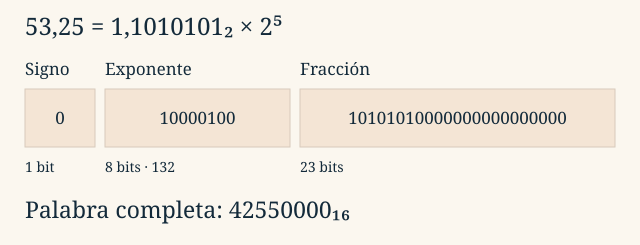

::::::: {.sheet .tema2-sheet}

:::::: {.running-head}
Tema 2 · Representación de la información

2.7
::::::

:::::: {.opening}
::::: {.kicker}
LECCIÓN 2.7
:::::

# ¿Cómo se guardan los decimales?

::::: {.deck}
La coma flotante combina signo, significando y exponente. Permite cubrir muchas magnitudes, pero sigue disponiendo de un número finito de patrones.
:::::

::::: {.short-rule}
:::::
::::::

:::::: {.lesson-section}
## 1. Mover la coma sin cambiar el valor

En notación científica, $53{,}25=5{,}325\times10^1$. Si desplazamos la coma, el exponente compensa el cambio. En base dos seguimos la misma idea, normalizando la magnitud como **$1\le M<2$**.

$$N=S\times M\times2^E$$

$S$ vale +1 o −1; $M$ es el **significando**, llamado mantisa en las diapositivas, y $E$ es el exponente real. Distinguiremos ese factor $S$ del bit de signo $s$: $S=(-1)^s$.

La parte entera de 53,25 es $110101_2$; su fracción es $0{,}01_2=1/4$. Por tanto:

$$53{,}25_{10}=110101{,}01_2=1{,}1010101_2\times2^5$$

Hemos desplazado cinco posiciones la coma hacia la izquierda y compensado con $2^5$. El valor no cambia.
::::::

:::::: {.lesson-section}
## 2. IEEE 754: campos con funciones distintas

Los formatos binarios de precisión simple y doble reparten sus bits así:

| Formato | Total | Signo | Exponente | Fracción | Sesgo |
|:--|--:|--:|--:|--:|--:|
| binary32 | 32 | 1 | 8 | 23 | 127 |
| binary64 | 64 | 1 | 11 | 52 | 1023 |

Para un **número normal** se almacena el exponente sesgado $e=E+\text{sesgo}$. El 1 inicial del significando es implícito: solo se guardan los bits de su fracción $f$.

::: {.rule-band}
$$N=(-1)^s(1+f)2^{e-\text{sesgo}}$$
Esta fórmula se aplica a **números normales**. Primero hay que comprobar el campo exponente.
:::

En binary32, los exponentes normales almacenados van de 1 a 254: $E=-126\ldots127$. En binary64 van de 1 a 2046: $E=-1022\ldots1023$.

Los 23 bits de fracción de binary32, con el 1 implícito, dan **24 bits de precisión** para normales. En binary64 son **53**. Más bits de fracción mejoran la precisión; más bits de exponente amplían el rango de magnitudes. `float` y `double` suelen corresponder a esos formatos en las implementaciones habituales de C, pero hay que comprobar el entorno.
::::::

:::::: {.lesson-section}
## 3. Codificar 53,25

Partimos de $1{,}1010101_2\times2^5$. El valor es positivo: $s=0$. El exponente almacenado es $e=5+127=132=10000100_2$. La fracción `1010101` se completa con ceros a la derecha hasta 23 bits.

{fig-alt="Tres campos etiquetados de 1, 8 y 23 bits para representar 53,25. La palabra completa en hexadecimal es 42550000."}

| Campo | Bits almacenados |
|:--|:--|
| Signo | `0` |
| Exponente | `10000100` |
| Fracción | `10101010000000000000000` |

La palabra completa es **42550000** en hexadecimal. Agrupamos los 32 bits de cuatro en cuatro **después** de construir los campos. Las fronteras entre cifras hexadecimales no tienen por qué coincidir con las fronteras entre signo, exponente y fracción.

Un segundo ejemplo: $4_{10}=100_2=1{,}0_2\times2^2$. Sus campos son $s=0$, $e=129$ y fracción nula. Su representación binary32 es **40800000**.
::::::

:::::: {.lesson-section}
## 4. Decodificar: recorrer el camino inverso

Considera **01F80000** como palabra IEEE 754 binary32, no como entero hexadecimal:

1. Despliega sus ocho cifras en 32 bits y separa 1 + 8 + 23.
2. Obtienes $s=0$, $e=00000011_2=3$ y fracción `1111000…`.
3. Como $1\le e\le254$, es normal: $E=3-127=-124$.
4. Recupera $M=1{,}1111_2=1{,}9375$ sumando los pesos: uno, un medio, un cuarto, un octavo y un dieciseisavo.

$$N=1{,}9375\times2^{-124}\approx9{,}1100812\times10^{-38}$$

El orden físico de los bytes en memoria es una cuestión adicional: no cambia la distribución conceptual de estos campos en la palabra de 32 bits.
::::::

:::::: {.lesson-section}
## 5. Cero, subnormales, infinitos y NaN

El campo exponente reserva dos extremos. La interpretación completa de binary32 es:

| Exponente $e$ | Fracción $f$ | Interpretación |
|:--|:--|:--|
| 1–254 | Cualquiera | Normal: $(-1)^s(1+f)2^{e-127}$ |
| 0 | 0 | Cero con signo |
| 0 | Distinta de 0 | Subnormal: $(-1)^s f\,2^{-126}$ |
| 255 | 0 | Infinito con signo |
| 255 | Distinta de 0 | NaN (*Not a Number*) |

Los subnormales —también llamados denormalizados— se acercan a cero sin el 1 implícito. Tienen menor precisión relativa. El menor positivo es $2^{-149}\approx1{,}40\times10^{-45}$; el menor normal es $2^{-126}\approx1{,}18\times10^{-38}$ y el mayor finito ronda $3{,}40\times10^{38}$.

| Valor | Palabra binary32 hexadecimal |
|:--|:--|
| +0 | 00000000 |
| −0 | 80000000 |
| 1 | 3F800000 |
| $+\infty$ | 7F800000 |
| $-\infty$ | FF800000 |
| Un ejemplo de NaN | 7FC00000 |

NaN tiene muchos patrones posibles. No todos los exponentes permiten añadir el 1 implícito.
::::::

:::::: {.lesson-section}
## 6. Rango no es precisión

Un formato finito no representa todos los reales. Por ejemplo, 0,1 no tiene expansión binaria finita; debe aproximarse. Más magnitud tampoco significa más detalle: los valores normales representables están más separados cuando crece el exponente.

Hay **desbordamiento** (*overflow*) cuando se supera la magnitud finita máxima. Cerca de cero, un resultado puede pasar a subnormal, perder precisión relativa o redondearse a cero: es la zona asociada al **agotamiento** (*underflow*).

Para comprobar el procedimiento, $87=1{,}010111_2\times2^6$ tiene $e=133$ y palabra **42AE0000**. En [los ejercicios](ejercicios.qmd#reales) codificarás un negativo y separarás casos especiales. Conserva el signo por separado: **no se aplica CA2 a toda la palabra IEEE 754**.
::::::

:::::: {.running-foot}
Fundamentos de Informática

Tema 2 · 2.7
::::::

:::::::

::: {.lesson-nav}
[← Anterior](06-enteros.qmd)

[Siguiente →](ejercicios.qmd)
:::
